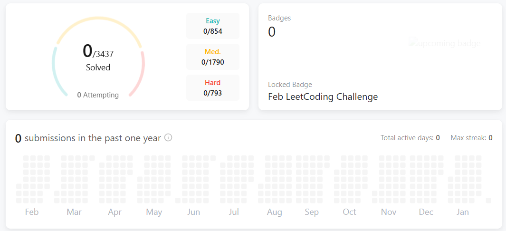

# 🧩 LeetCode Problem-Solving with Python  

  
*(Above: My LeetCode progress dashboard)*  

## 🚀 About the Project  
This repository contains my Python solutions to LeetCode problems.  
I tackle these challenges daily to improve my algorithmic thinking, problem-solving skills, and code efficiency.  

Each solution includes:  
- Clean, readable Python code  
- Explanations and handling of edge cases  
- Optimized approaches whenever possible  

---

## 📂 Repository Structure  

📦 leetcode-python-solutions <br>
├── README.md <br>
├── images/ (for the dashboard image) <br>
└── solutions/ <br>
├── arrays/ <br>
├── strings/ <br>
├── linked_lists/ <br>
├── dynamic_programming/ <br>
└── sorting_searching/ <br>

**Example Structure:**  
- **Problem Name:** `solutions/arrays/two_sum.py`  
- **Content:** Solution with comments and explanations  

---

## 🔧 How to Use  

1. Clone the repository:  
   ```bash
   git clone https://github.com/oumaima1115/LeetCode.git
Browse solutions by category.
Read explanations in the code comments.
🏆 LeetCode Progress
I track my daily problem-solving journey using the LeetCode platform.
Categories include:

Easy Problems: Foundational problem-solving patterns
Medium Problems: Complex algorithmic thinking
Hard Problems: Advanced challenges for optimization
🌟 Topics Covered
Data Structures: Arrays, Linked Lists, Trees, Graphs
Algorithms: Sorting, Searching, Dynamic Programming, Recursion
Optimization Techniques: Reducing time and space complexity
📝 Notes
All solutions are tested with edge cases.
Feedback and suggestions are welcome!
📧 Contact
Feel free to connect with me on LinkedIn or raise an issue here for discussions.

Make sure to create the `images` folder and add your LeetCode dashboard image as `leetcode_dashboard.png`.

Would you like me to help you structure the project folders too? 
